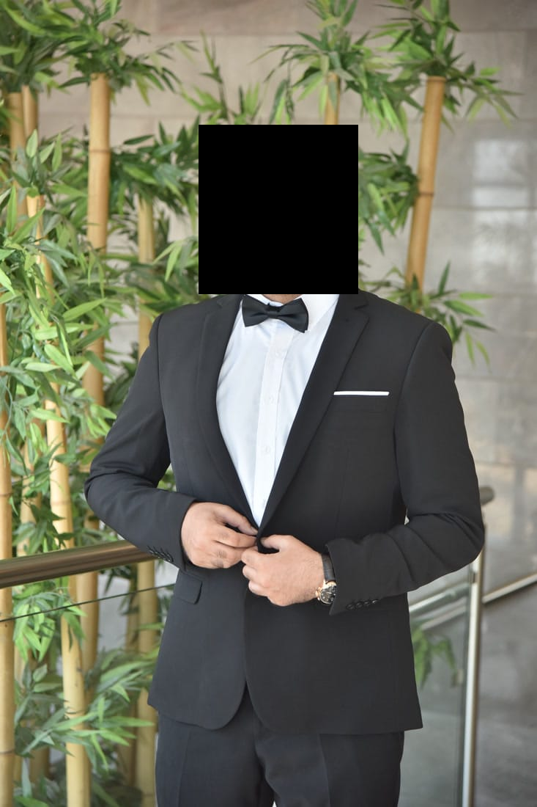
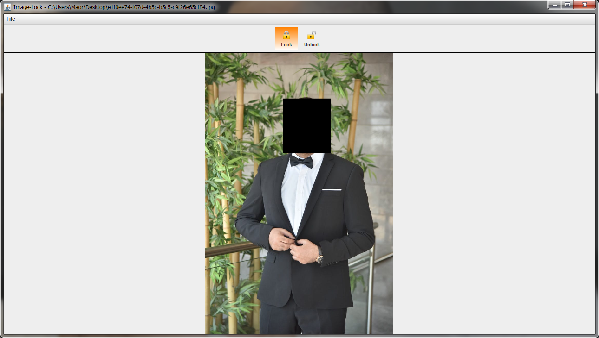

# image-lock
locking sensitive parts of image with custom password.

sometimes you have a nice picture that you wish to keep, but for some reason (ahm..) you rather mask some of the data out and only view it when you wish to - using your own custom password.
this is exactly why i created image-lock.

# unlocked
# 

# locked
# 

# image-lock
# 